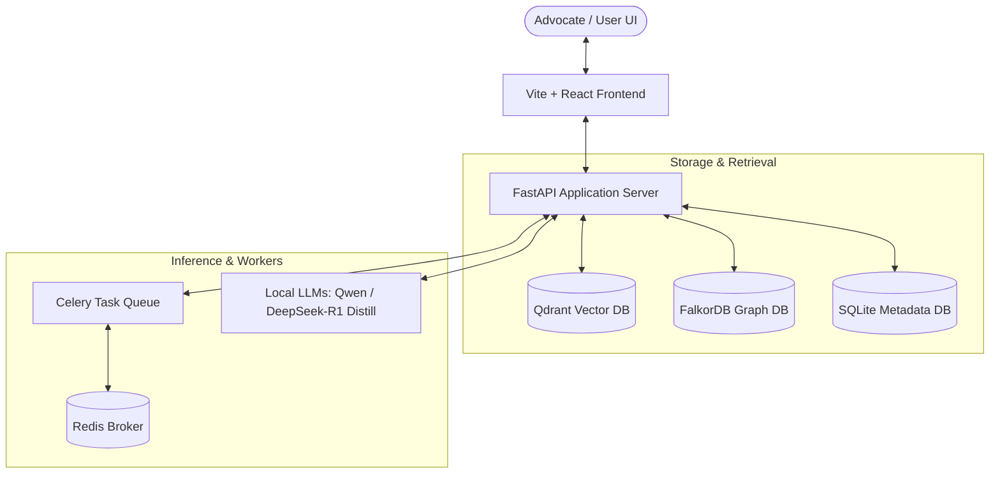
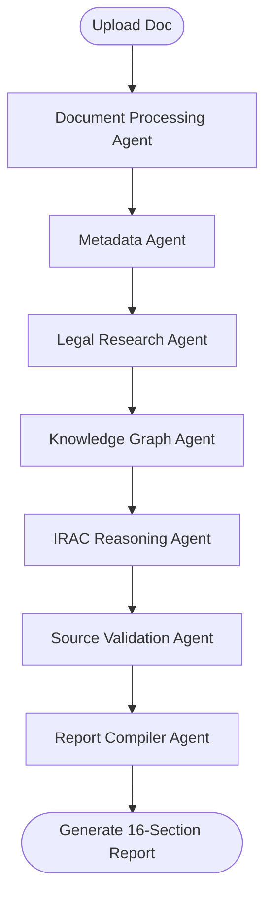
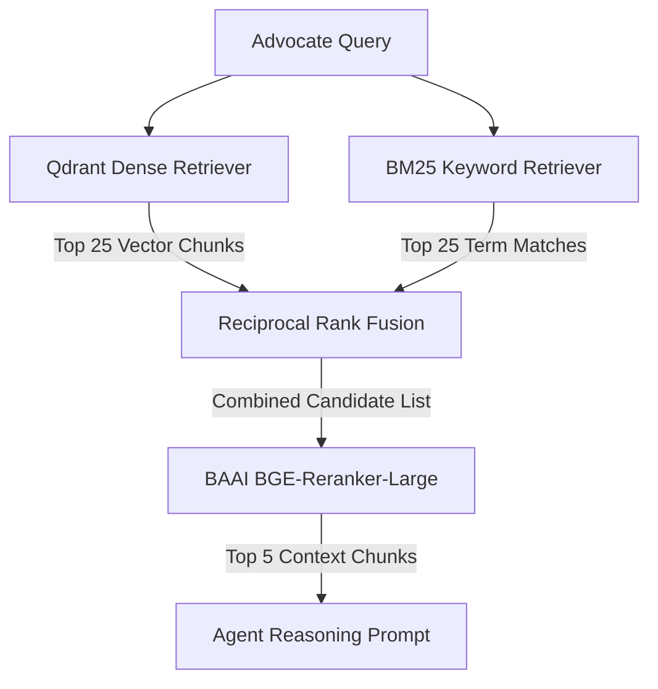

# LexOrch-KG: Trust-Aware Multi-Agent Legal Advisory Framework

**LexOrch-KG** is an end-to-end, trust-aware multi-agent legal advisory framework specializing in Indian Criminal Law and Statutory Analysis. Designed for advocates, it processes case documents (such as court judgments, petitions, and briefs) to generate highly grounded, trust-calibrated 16-section advisory reports. 

By combining dense vector search (**Qdrant**) with a Graph-relational Database (**FalkorDB**) in a hybrid Retrieval-Augmented Generation (RAG) architecture, LexOrch-KG eliminates common LLM hallucinations and traces every extracted fact, legal issue, and statute back to its source page in the document.

---

## 🏗️ System Architecture

The application is structured into three main layers:



### 1. Frontend (Vite + React + TypeScript)
* **Visual Interface**: Sleek dark-mode glassmorphic theme designed using Tailwind CSS and Framer Motion.
* **SSE Progress Tracker**: Connects to FastAPI Server-Sent Events (SSE) to display a real-time progress checklist of the multi-agent ingestion and reasoning cycle.
* **Grounded Metadata Cards**: Renders document parameters (petitioner, respondent, dates, citations) using structured value/status pairs, preventing guess fallbacks.
* **Provenance Visualizer**: Under every legal issue and fact, the UI displays a provenance footer highlighting the **file name**, **page number**, **confidence score**, and **exact supporting sentence** from the source document.
* **Explainability Graph**: Renders a D3.js force-directed 2D/3D graph visualization representing entity relations, sections, and precedent nodes.
* **Grounded Chatbot**: Includes a case-specific chatbot that executes vector queries restricted to the uploaded document to prevent out-of-context hallucinations.

### 2. Backend (FastAPI + Celery + SQLAlchemy)
* **API Gateway**: Exposes asynchronous endpoints, handles dependency injection, manages user auth/sessions, and handles uploads.
* **Celery Workers**: Distributes CPU-intensive operations (PDF parsing, OCR extraction, embeddings generation, and agent reasoning loops) to background processes backed by a Redis broker.
* **Logging**: Detailed file and terminal logging powered by Loguru for monitoring agent progress.

### 3. Retrieval & Storage Layer
* **Qdrant Vector DB**: Indexes chunks of the Indian Constitution, central Acts, and uploaded case documents using the BGE-M3 embedding model (1024 dimensions).
* **FalkorDB Graph DB**: Built as a Redis graph module, it maps semantic links, sections, citations, and court precedents.
* **SQLite Database**: Serves as the relational database for user accounts, case records, document lists, and compiled analysis reports.

---

## 🤖 Multi-Agent Pipeline & LangGraph Flow

The backend orchestrates analysis via a stateful multi-agent system powered by **LangGraph** and local LLM models:



1. **Document Processing Agent**: Extracts character text from the PDF page-by-page. Automatically triggers a PaddleOCR fallback if page character count is lower than 100 to parse scanned documents.
2. **Metadata Agent**: Extracts case metadata (court name, petitioner, respondent, date) into structured objects: `{"value": ..., "status": "extracted" | "not_found"}`.
3. **Legal Research Agent**: Conducts dense vector searches and BM25 keyword lexical searches to locate relevant central Acts, Constitution articles, and precedents.
4. **Knowledge Graph Agent**: Models and links entities, citations, and precedents inside FalkorDB.
5. **IRAC Legal Reasoning Agent**: Formulates legal arguments based on the Issue-Rule-Application-Conclusion paradigm.
6. **Source Validation Agent (The Grounding Layer)**: Re-scans all generated facts, issues, and strategic claims against the original document pages using a string-overlap algorithm to extract page numbers, confidence levels, and direct quotes. Non-relevant precedents (similarity score < 40%) are automatically pruned.
7. **Report Compiler Agent**: Assembles the executive summary and synthesizes the finalized trust-calibrated report.

---

## 🗄️ Detailed Database Schema & Model structures

The relational storage layer uses SQLite with SQLAlchemy asynchronous models (`app/db/models/__init__.py`). Below is the data model design:

### 1. User Model (`users` table)
Represents registered advocates accessing the platform.
* `id` (String, PK): UUID representing the user.
* `email` (String, Unique, Indexed): User's registration email.
* `hashed_password` (String): Securely hashed password.
* `is_active` (Boolean): Active state flag.
* `created_at` (DateTime): Record creation timestamp.

### 2. Case Model (`cases` table)
Represents a legal case brief directory folder.
* `id` (String, PK): Case UUID.
* `title` (String): Advocate-defined case folder title.
* `description` (Text): Summary notes or client description.
* `case_type` (String): Category matter (e.g. Criminal Defense, Property Claim).
* `status` (String): pipeline processing state (e.g. `draft`, `analysis_complete`).
* `user_id` (String, FK -> `users.id`): Folder owner.
* `court_name` (String, Nullable): Targeted jurisdiction.
* `case_number` (String, Nullable): Filing registration code.

### 3. Document Model (`documents` table)
Preserves raw and parsed text files uploaded to a Case Folder.
* `id` (String, PK): Document UUID.
* `case_id` (String, FK -> `cases.id`): Attached case folder.
* `filename` (String): Uploaded document file name.
* `filepath` (String): Absolute storage path.
* `file_size` (Integer): Size in bytes.
* `mime_type` (String): Mime type (e.g., `application/pdf`).
* `page_count` (Integer): Total pages extracted.
* `parsed_text` (Text): Extracted textual body.
* `metadata_` (JSON): Structured JSON storing page boundaries and OCR statuses.

### 4. Analysis Model (`analyses` table)
Persists the raw structured outputs returned by the LangGraph multi-agent loop.
* `id` (String, PK): Analysis record UUID.
* `case_id` (String, FK -> `cases.id`): Context Case.
* `summary` (Text): Core case executive brief.
* `legal_issues` (JSON): List of extracted legal questions and their categories.
* `applicable_acts` (JSON): Applicable legal codes.
* `applicable_sections` (JSON): Linked statutory sections with relevance weights.
* `precedents` (JSON): Filtered judicial precedents containing citation data.
* `contradictions` (JSON): Inconsistent statements or procedural conflicts found.
* `risk_assessment` (JSON): Strategic risks and likelihood metrics.
* `procedural_status` (JSON): Administrative compliance details.
* `strategy_options` (JSON): Strategic defense/prosecution tracks.
* `agent_results` (JSON): Individual agent processing status logs.
* `trust_score` (Float): Calibrated score based on evidence overlap.

### 5. Report Model (`reports` table)
Persists compiled, client-ready advisory documents structured for tab layouts.
* `id` (String, PK): UUID.
* `case_id` (String, FK -> `cases.id`): Parent case folder.
* `title` (String): Report name.
* `sections` (JSON): 16-section array storing `order`, `title`, and `content`.
* `trust_score` (Float): Overall report calibration metric.
* `explanation_graph` (JSON): Precomputed D3 explainability node-link model.
* `knowledge_graph` (JSON): Precomputed FalkorDB graph snapshot payload.

---

## 🔍 Deep-Dive on Hybrid Retrieval Search

The framework implements a hybrid RAG pipeline (`app/rag/rag_pipeline.py`) merging semantic and keyword search, followed by reranking to construct absolute agent contexts:



### 1. Dense Semantic Retrieval (Qdrant)
Uses local **BGE-M3 (BAAI/bge-m3)** embeddings to generate 1024-dimensional dense vectors. It queries Qdrant collections (`legal_documents` or `legal_sections`) using cosine similarity, catching synonyms and general legal concepts.

### 2. Lexical Search (BM25 Keyword Index)
Operates simultaneously to match exact terminology, statutory sections (e.g. "Section 111 BNS"), and specific act titles which might be diluted in pure vector space.

### 3. Reciprocal Rank Fusion (RRF)
Combines candidates from both retrieval tracks using the standard RRF formula:
$$RRF\_Score(d) = \sum_{m \in M} \frac{1}{60 + r_m(d)}$$
Where $r_m(d)$ is the rank of document $d$ in retriever $m$. This fuses vector relevance with exact statutory keyword preservation.

### 4. CrossEncoder Reranking
The fused candidates are passed to a local **ms-marco-MiniLM-L-6-v2** CrossEncoder:
* Unlike Bi-Encoders, it processes the Query and Chunk jointly, calculating attention scores directly between them.
* Re-orders candidates to place chunks with high factual relevance at the very top, pruning irrelevant fragments.

---

## 🕸️ FalkorDB Knowledge Graph Schema

Entities, citations, and precedents are linked in a graph database (`app/kg/falkordb_client.py`). Below is the graph model:

### 1. Node Labels
* **`Case`**: Context node for an active case folder.
* **`Party`**: Extracted person or organization (Petitioner, Respondent, Accused).
* **`Section`**: Specific statutory law citation (e.g., Section 111 BNS).
* **`Article`**: Constitutional clauses (e.g., Article 14).
* **`Citation`**: Landmark precedents (e.g., *Sanjay Chandra v. CBI*).

### 2. Edge Relationships
* **`(:Case)-[:INVOLVES]->(:Party)`**: Connects litigant names to cases.
* **`(:Case)-[:VIOLATES]->(:Section)`**: Connects accused acts to specific statutory sections.
* **`(:Section)-[:SUBJECT_TO]->(:Article)`**: Checks constitutionality of applied codes.
* **`(:Case)-[:CITES]->(:Citation)`**: Connects relevant legal citations.
* **`(:Citation)-[:INTERPRETS]->(:Section)`**: Tracks which judicial precedent applies to what statute section.

---

## 📋 Breakdown of the 16-Section Advisory Report

The final advisory payload compiles into 16 structured, advocate-aligned sections:

1. **Executive Summary**: 3-4 sentence high-level summary of findings.
2. **Case Facts**: Grounded timeline facts annotated with source page provenance.
3. **Legal Issues Identified**: Found issues categorized as `DOCUMENT FACT` or `AI LEGAL ANALYSIS`.
4. **Applicable Acts**: List of governing acts relevant to the matter.
5. **Applicable Sections**: Detailed statutory definitions, including whether they were explicitly cited in the PDF or dynamically inferred.
6. **Supporting Judgments**: Reranked case laws that match the legal questions.
7. **Evidence Analysis**: Assessments of device verify logs, electronic files (under BSA Section 63), or witness records.
8. **Contradiction Analysis**: Inconsistencies found in statements or testimonies.
9. **Risk Assessment**: Matrix of potential liabilities, strategies, and success probabilities.
10. **Procedural Compliance**: Checks on mandatory procedural rules.
11. **Strategy Recommendation**: Actionable options for defense or prosecution briefs.
12. **Trust Score**: Quantitative percentage score reflecting factual grounding.
13. **Confidence Scores**: Individual agent confidence ratings based on context.
14. **Explainability Graph**: Active node-edge linkage representation of the reasoning model.
15. **Knowledge Graph Snapshot**: Visual snapshot representation of the FalkorDB schema.
16. **References and Disclaimer**: Standard legal disclaimer and bibliography list.

---

## 💻 Quantized LLM & GPU Developer Guide

LexOrch-KG supports running fully local, quantized LLMs on consumer GPUs (NVIDIA RTX series) to keep legal data private.

### 1. Swapping to Llama.cpp (GGUF Models)
Llama.cpp provides CPU/GPU split inference, which is ideal for running large models on limited VRAM.

1. **Download GGUF Weights**:
   Download a model like `Qwen2.5-7B-Instruct-Q4_K_M.gguf` and save it to the `models/` folder.
2. **Configure `.env`**:
   ```env
   LLM_PROVIDER=llamacpp
   LLM_MODEL_PATH=/home/gokul/Downloads/final-year-project/models/Qwen2.5-7B-Instruct-Q4_K_M.gguf
   ```
3. **VRAM Offloading Parameter**:
   Adjust `n_gpu_layers` inside the provider loader config (e.g. `n_gpu_layers=35`) to offload layers to CUDA.

### 2. Swapping to HuggingFace Transformers (GPU Mode)
For servers with dedicated GPU setups (e.g., V100/A100 or high VRAM RTX GPUs), load models using PyTorch's native transformer configurations.

1. **Configure `.env`**:
   ```env
   LLM_PROVIDER=transformers
   LLM_MODEL_NAME=Qwen/Qwen2.5-7B-Instruct
   ```
2. **GPU Optimization**:
   The loader (`transformers_provider.py`) automatically initializes models in 16-bit floating point (`torch.float16`) and uses `device_map="auto"` to load parameters directly onto VRAM.

---

## 📂 Repository Structure

```text
├── backend/                   # FastAPI backend application
│   ├── app/                   # API, core configs, services, and models
│   │   ├── agents/            # Multi-agent analyst & verification logic
│   │   ├── api/               # API Router endpoints (v1 routes)
│   │   ├── core/              # Config settings, logging, and security
│   │   ├── db/                # DB sessions, models, and migrations
│   │   ├── document_pipeline/ # PDF Parsing, page chunking, and OCR fallback
│   │   ├── embeddings/        # BGE-M3 model & Qdrant manager integration
│   │   ├── kg/                # FalkorDB client, entity extractors, and query builders
│   │   ├── llm/               # Provider bindings (Mock, Qwen, Transformers, LlamaCPP)
│   │   └── rag/               # Vector, keyword, citation retrievers and rerankers
│   │   └── schemas/           # Pydantic serialization models
│   ├── scripts/               # Ingestion and download scripts
│   └── tests/                 # Unit & integration testing suites
├── configs/                   # Env configuration templates
├── datasets/                  # Source Acts PDFs & legal corpora
├── docker/                    # Dockerfiles & docker-compose configurations
├── frontend/                  # React + TS + TailwindCSS web application
│   ├── src/
│   │   ├── components/        # Layout, D3 CaseGraph, and UI primitives
│   │   ├── pages/             # Dashboard, Cases, Analysis, and Auth pages
│   │   ├── stores/            # State management (Zustand)
│   │   └── types/             # Frontend type definitions
└── models/                    # Local model weight storage (BGE-M3, LLMs)
```

---

## 🛠️ Getting Started

### Prerequisites
* Docker & Docker Compose
* Python 3.10 - 3.13 (`python3.13` recommended)
* Node.js (v18+) & npm

---

### ⚡ Quick Start: Running the Project

To run the complete application, open separate terminals for the backend and frontend services:

#### Step 1: Start Database Containers
```bash
# Start pre-configured Qdrant and FalkorDB containers
docker start lexorch-qdrant falkordb

# OR if starting for the first time via Docker Compose:
docker compose -f docker/docker-compose.yml up -d qdrant falkordb redis
```

#### Step 2: Start the Backend Server
```bash
cd backend
source .venv/bin/activate
uvicorn app.main:app --reload --host 0.0.0.0 --port 8000
```
> **Note:** If creating a fresh virtual environment on systems where Python 3.14 is default, initialize with Python 3.13:
> `python3.13 -m venv .venv && source .venv/bin/activate && pip install -r requirements.txt`

#### Step 3: Start the Frontend Client
```bash
cd frontend
npm install
npm run dev
```

#### 🌐 Access Links
| Service | URL | Description |
| :--- | :--- | :--- |
| **Frontend Web App** | [`http://localhost:5173`](http://localhost:5173) | Interactive Legal Advisory UI |
| **Backend Swagger Docs** | [`http://localhost:8000/docs`](http://localhost:8000/docs) | Interactive OpenAPI / Swagger UI |
| **Backend Health Check** | [`http://localhost:8000/health`](http://localhost:8000/health) | API & System Health endpoint |
| **Qdrant Dashboard** | [`http://localhost:6333/dashboard`](http://localhost:6333/dashboard) | Vector DB web console |

---

### Detailed Setup & Ingestion

#### 1. Configure Environments
Copy the configuration template to root and backend:
```bash
cp configs/.env.example .env
cp configs/.env.example backend/.env
```

#### 2. Setup Backend Virtual Environment
```bash
cd backend
python3.13 -m venv .venv
source .venv/bin/activate
pip install -e .
```
*(If you have an NVIDIA GPU, verify that PyTorch is installed with CUDA support to enable fast local BGE-M3 embeddings).*

#### 3. Download Local BGE-M3 Embeddings (Optional)
To cache the BGE-M3 model weights locally for offline acceleration:
```bash
python setup_bge_m3.py
```
This saves the model weights under `models/bge-m3/`.

#### 4. Ingest Legal Corpora
Seed your vector database with the core legal dataset (Indian Constitution and central Acts):
```bash
# Ingest the Indian Constitution
python scripts/ingest_constitution.py

# Ingest other central Acts and dataset corpus files
python scripts/ingest_datasets.py
```

---

## 📊 Codebase Statistics

The application contains **15,854 total lines of code** divided as follows:

| Layer | Area / Component | File Count | Lines of Code | Language |
| :--- | :--- | :---: | :---: | :---: |
| **Backend Core** | LangGraph Agents | 4 | 1,414 | Python |
| | API Routers & Gateways | 12 | 1,372 | Python |
| | Document Extraction & Parser | 7 | 1,029 | Python |
| | Retrieval, Search & Reranking | 8 | 1,180 | Python |
| | LLM Integration & Providers | 8 | 1,558 | Python |
| | FalkorDB Knowledge Graph | 6 | 1,114 | Python |
| | DB Sessions & Schemas | 10 | 1,280 | Python |
| | Task Queue & Celery Config | 10 | 1,003 | Python |
| **Tests & Scripts**| Automated Unit/Integration Tests | 4 | 344 | Python |
| | Seed Ingestion Scripts | 3 | 661 | Python |
| **Frontend** | React Pages | 9 | 2,408 | TypeScript / TSX |
| | UI Components & Layout | 12 | 1,178 | TypeScript / TSX |
| | State Stores & Types | 6 | 210 | TypeScript / TS |
| | Stylesheets (CSS) | 1 | 108 | CSS |

---

## 🧪 Verification & Testing

### 1. Database Health Check API
You can check container connections, vector collection counts, and dimensions via:
👉 **`GET http://localhost:8000/api/v1/health/retrieval`**

### 2. Verify Qdrant Dashboard
Monitor embedded points and collections directly:
👉 **`http://localhost:6333/dashboard`**

### 3. Run Automated Tests
Run pytest in the backend directory to execute unit and provider tests:
```bash
.venv/bin/pytest
```

### 4. Batch Evaluation (600 docs)

`backend/scripts/batch_eval.py` validates that the deterministic pipeline
(`DocumentParser` → `build_analysis`) produces **grounded, leak-free output**
across the full corpus in `backend/test_data/` (600 unseen judgments), with
per-file checkpoints for resumable runs.

```bash
cd backend
# standard run: parse + analyze + validate V01-V10, 8 parallel workers
python -m scripts.batch_eval --dir ./test_data --out ./reports --workers 8

# optional LLM-layer spot checks on a stratified sample (5 docs/category)
python -m scripts.batch_eval --dir ./test_data --out ./reports --workers 8 --with-llm --sample 5

# CI-friendly pytest wrapper over the same validators
pytest tests/test_batch_grounding.py
```

Scanning is flat by default; add `--recurse` to sweep subdirectories.
Progress is cached per file under `backend/.cache/eval/<sha1>.json`, so
re-runs only process new/changed documents.

**Validation rules** (each violation = `{code, message}`):

| Code | Check |
|------|-------|
| V01 | No exception raised during ingest → analyze |
| V02 | Banned-string scan over every string value (`"Not found in document"`, `"Mock summary"`, `"keyword"`, `"vector"`, `"Applicable Statutes"`, raw dict reprs, …) |
| V03 | `metadata.case_title` non-empty and never equal to the filename stem |
| V04 | Every metadata field status ∈ `{extracted, inferred, not_found}` |
| V05 | `trust_score ∈ [40, 99]` — never 100 |
| V06 | Timeline non-empty; tail event date equals extracted `decision_date` |
| V07 | Every statute has a formatted display containing `—` and the act name |
| V08 | Precedents: no junk names, no self-match vs case title, similarity ≤ 100, one citation bound to one name |
| V09 | Category ∈ `{criminal_bail, criminal_trial, civil, arbitration, writ, other}` |
| V10 | Submissions/evidence/risk populated; labels match `LABELS[category]` |

With `--with-llm`, sampled docs additionally check: **L01** issues[] non-empty,
**L02** conclusion contains an operative verb (`allowed|dismissed|disposed|set
aside`), and **L03** every supporting quote exists verbatim
(whitespace-insensitive) in the source text.

**Report fields** (`reports/eval_<ts>.json` + `.csv`):

- Aggregate: `total`, `parsed`, `parse_fail`, `pass_count`, `pass_rate`,
  `categories` histogram, `avg_coverage`
  (= extracted / (extracted+inferred+not_found)), `avg_trust`,
  `top_violations`, `hard_violations` (V02/V03/V08), `failed_files`.
- CSV row per file: `name, category, trust, coverage, violations`.

**Exit code** is `0` iff `pass_rate ≥ 0.95` **and** zero V02/V03/V08 violations.

---

## 📊 Evaluation Framework

A complete 8-suite evaluation framework lives in `backend/evals/` +
`backend/scripts/eval_suite.py`, gated by a hand-verified GOLD dataset
(`evals/gold.py`: vikram / ananya / apex / mehta).

```bash
cd backend
make eval                 # all 8 suites + JSON/CSV/HTML reports
make eval-corpus          # E7 robustness over all 600 test_data docs (checkpointed)
python -m scripts.eval_suite --suite retrieval            # single suite
python -m scripts.eval_suite --suite all --dir ./test_data --workers 8 --with-llm
pytest tests/test_eval_suite.py           # CI gate
```

| Suite | What it measures | Pass gate |
|-------|------------------|-----------|
| **E1 extraction** | per-field exact match vs GOLD; section→act F1, article F1, precedent name+citation pairs, timeline recall | macro-F1 ≥ 0.90 |
| **E2 retrieval** | Recall@5 / P@5 / MRR / nDCG@10 over gold qrels; ablation matrix: bm25-only / vector-only / hybrid-RRF / hybrid+reranker | MRR ≥ 0.80 |
| **E3 grounding ⭐** | banned-string scan, whitespace-insensitive verbatim quotes, citation binding, no self-match, trust ∈ [40,99] | violations = 0 |
| **E4 reasoning** | IRAC completeness; outcome verb vs GOLD (`allowed/partly allowed/disposed of/dismissed`); label accuracy; optional `--with-llm` judge (temp 0, rubric 1–5) | IRAC = 1.0, outcome ≥ 0.75 |
| **E5 human** | generates `reports/human_eval_pack.md`: fact-check Qs w/ gold answers, 4-dim Likert sheet, 10-item SUS | — |
| **E6 performance** | p50/p95 ms per pipeline stage (parse→metadata→…→gate), docs/min, RSS delta | ≥ 10 docs/min |
| **E7 robustness** | `--dir`: full-corpus pass rate + category histogram + top violations (reuses `.cache/eval/<sha1>.json` checkpoints); else leave-one-category-out cue masking | pass rate ≥ 0.95 (when `--dir`) |
| **E8 ablation** | Δ table: `full / -kg / -gate / -bm25 / -vector / -reranker` on E1 F1, E2 MRR, E3 violations | — |

**Global exit gate:** `0` iff E1 F1 ≥ 0.90 **AND** E3 violations = 0 **AND**
E2 MRR ≥ 0.80 **AND** (E7 ≥ 0.95 when `--dir` is passed).

Reports land in `backend/reports/eval_<ts>.json`, `.csv`, and a self-contained
`.html` dashboard (suite cards with red/green chips, violation histogram,
latency bars, ablation Δ table). Retrieval runs on CPU by default so a live
server keeps its GPU memory (`LEXORCH_EVAL_DEVICE=cuda` to override).

---


## 📜 License
This project is licensed under the Apache-2.0 License. See the LICENSE file for details.