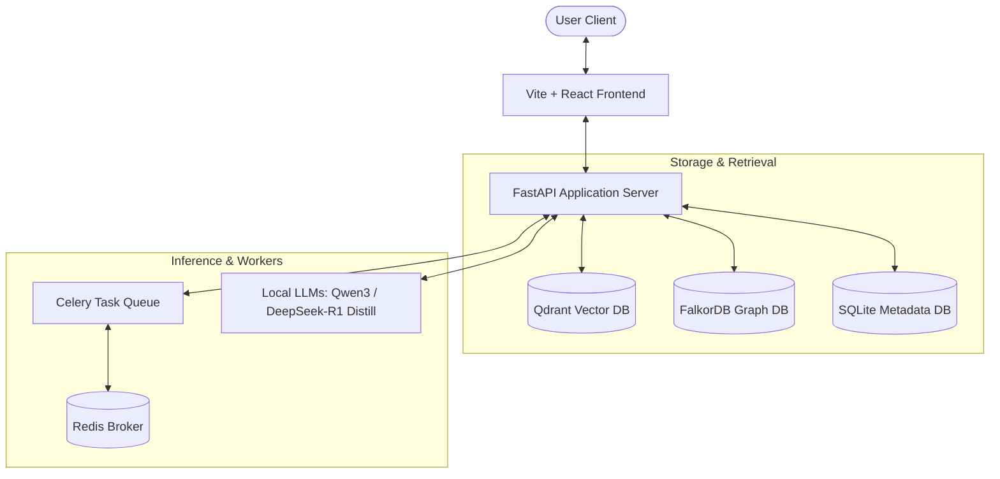

# LexOrch-KG: Trust-Aware Multi-Agent Legal Advisory Framework

**LexOrch-KG** is an end-to-end, trust-aware multi-agent legal advisory framework specializing in Indian Criminal Law. It integrates **Hybrid RAG** (Retrieval-Augmented Generation) combining semantic vector search with a Knowledge Graph to deliver highly accurate, explainable legal insights and case summaries.

---

## 🏗️ System Architecture

The project is structured into three main layers:
1. **Frontend**: React, TypeScript, and Vite-based web application with modern responsive layouts and real-time streaming components.
2. **Backend**: FastAPI web server handling document processing, multi-agent reasoning loops, and database interfaces.
3. **Infrastructure**: Multi-container Docker configuration hosting the databases, task queues, and brokers.



---

## 🚀 Key Features

* **Hybrid Legal RAG**: Blends dense vector search (**Qdrant**) using **BGE-M3 embeddings** (1024-dimension) with a graph-relational database (**FalkorDB**) to capture exact statutory relationships.
* **Dual-Agent Legal Reasoning**:
  * **Qwen-3 (Legal Analyst)**: Generates case understanding, structured summaries, and initial research reports.
  * **DeepSeek-R1 (Devil's Advocate)**: Conducts evidence verification, contradiction detection, and legal strategy validation.
* **Complete Statutes & Precedents**: Preloaded with the Indian Constitution, 60+ major Central Acts, new criminal laws (BNS, BNSS, BSA, IPC), and over 450,000 judicial precedents.
* **Asynchronous Document Pipelines**: Leverages Celery workers and Redis to process and ingest massive legal files seamlessly.

---

## 📁 Repository Structure

```text
├── backend/                   # FastAPI backend application
│   ├── app/                   # API, core configs, services, and models
│   │   ├── agents/            # Multi-agent analyst & verification logic
│   │   ├── core/              # Config settings, logging, and exceptions
│   │   ├── embeddings/        # BGE-M3 model & Qdrant manager integration
│   │   ├── llm/               # Provider bindings (llama.cpp, Transformers, API)
│   │   └── rag/               # Vector & citation retrieval systems
│   ├── scripts/               # Datasets, Constitution, and QA ingestion scripts
│   └── tests/                 # Unit & integration testing suites
├── configs/                   # Env configuration templates
├── datasets/                  # Source Acts PDFs & legal corpora
├── docker/                    # Dockerfiles & docker-compose configurations
├── frontend/                  # React + TS + TailwindCSS web application
└── models/                    # Ignored local model weight storage (Mistral, Qwen, BGE-M3)
```

---

## 🛠️ Getting Started

### 1. Environment Configuration
Copy the configuration template to your environment file in the project root:
```bash
cp configs/.env.example .env
```
Ensure to also copy or maintain `.env` inside the `backend/` folder.

### 2. Start the Databases (Docker)
Ensure your Docker service is running, then start the Qdrant and FalkorDB containers:
```bash
# Starts Qdrant (v1.10.0) on port 6333 and FalkorDB on port 6380
docker run -d -p 6333:6333 -p 6334:6334 --name lexorch-qdrant qdrant/qdrant:v1.10.0
docker run -d -p 6380:6379 --name lexorch-falkordb falkordb/falkordb:latest
```

### 3. Setup Backend Virtual Environment
Navigate to the `backend/` directory, create a virtual environment, and install dependencies:
```bash
cd backend
python3 -m venv .venv
source .venv/bin/activate
pip install -e .
```
*(If you have an NVIDIA GPU, make sure PyTorch is installed with CUDA support to enable fast BGE-M3 embeddings).*

### 4. Setup local BGE-M3 Embeddings
To download the model locally for offline GPU acceleration, run:
```bash
python setup_bge_m3.py
```
This saves the BGE-M3 weights into `models/bge-m3/`.

### 5. Ingest datasets
Run the ingestion pipelines to chunk, embed, and store the Constitution and legal acts into Qdrant:
```bash
# Ingest the complete Indian Constitution
python scripts/ingest_constitution.py

# Ingest other central Acts and dataset corpus files
python scripts/ingest_datasets.py
```

### 6. Run Development Servers
* **Backend**:
  ```bash
  cd backend
  source .venv/bin/activate
  uvicorn app.main:app --reload --host 0.0.0.0 --port 8000
  ```
* **Frontend**:
  ```bash
  cd frontend
  npm install
  npm run dev
  ```

---

## 📊 Verification
To check the vector database status, open your browser and navigate to the built-in Qdrant Web UI:
👉 **`http://localhost:6333/dashboard`**

To verify search and model loader functionality on your GPU, execute:
```bash
python verify_qdrant.py
```

---

## 📜 License
This project is licensed under the Apache-2.0 License.