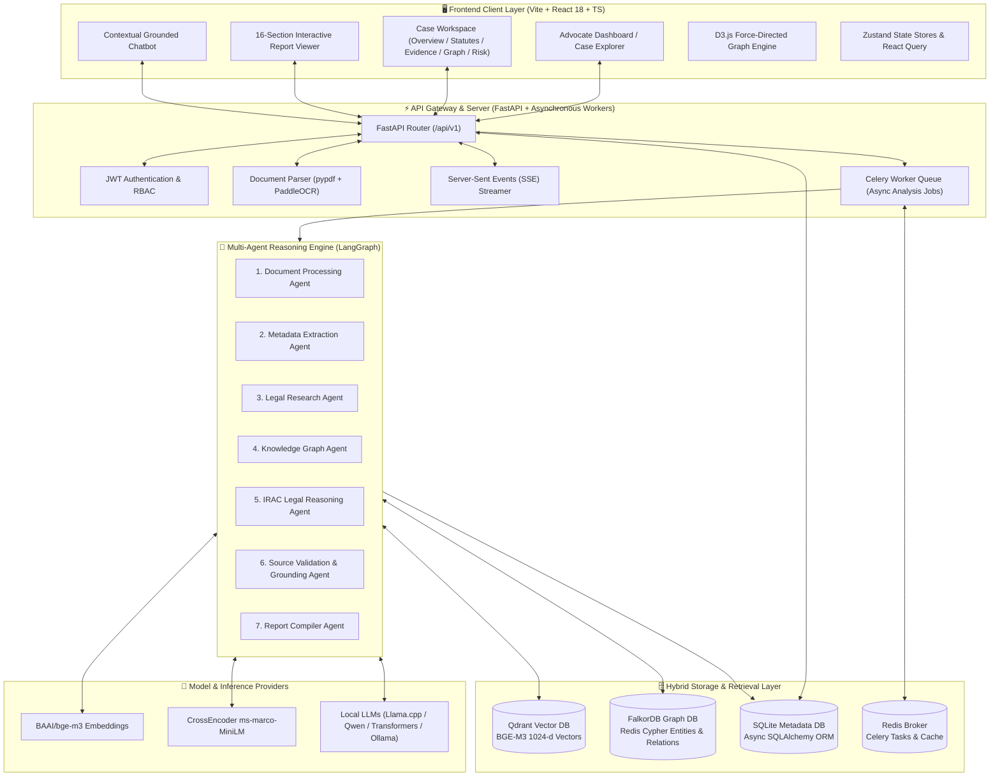
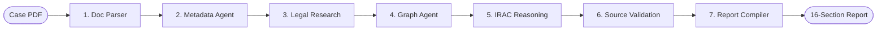
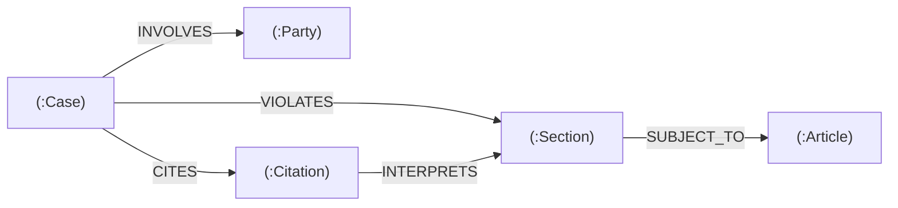

# LexOrch-KG: Trust-Aware Multi-Agent Legal Advisory Framework

[](https://python.org)
[](https://fastapi.tiangolo.com)
[](https://react.dev)
[](https://www.typescriptlang.org)
[](https://tailwindcss.com)
[](https://qdrant.tech)
[](https://www.falkordb.com)
[](LICENSE)

**LexOrch-KG** is an end-to-end, trust-calibrated multi-agent legal advisory framework specializing in Indian Criminal Law, Constitutional Jurisprudence, and Statutory Analysis (including the Bharatiya Nyaya Sanhita [BNS], Bharatiya Nagarik Suraksha Sanhita [BNSS], and Bharatiya Sakshya Adhiniyam [BSA]).

Designed for advocates and legal researchers, LexOrch-KG ingests case files (FIRs, charge sheets, trial petitions, High Court and Supreme Court judgments) and synthesizes a **16-section structured legal advisory report**. By uniting **Dense Vector Search (Qdrant)**, a **Knowledge Graph (FalkorDB)**, and **Verbatim Source Provenance Validation**, LexOrch-KG eliminates generative hallucinations, attributing every factual finding, statutory section, and precedent directly to source page numbers and quote excerpts.

---

## 📑 Table of Contents

- [Key Highlights](#-key-highlights)
- [System Architecture](#-system-architecture)
  - [High-Level Architectural Diagram](#high-level-architectural-diagram)
  - [Component Interaction & Data Flow](#component-interaction--data-flow)
- [Frontend Architecture & Features](#-frontend-architecture--features)
  - [Tech Stack & UI Design System](#tech-stack--ui-design-system)
  - [Application Pages & Workflows](#application-pages--workflows)
  - [Interactive Case Workspace](#interactive-case-workspace)
  - [Explainability & D3 Graph Visualizer](#explainability--d3-graph-visualizer)
  - [Grounded Assistant & Chatbot Drawer](#grounded-assistant--chatbot-drawer)
- [Backend Architecture & Pipeline](#-backend-architecture--pipeline)
  - [Core Technologies & Services](#core-technologies--services)
  - [7-Agent LangGraph Workflow](#7-agent-langgraph-workflow)
  - [Hybrid RAG Search Engine](#hybrid-rag-search-engine)
  - [FalkorDB Knowledge Graph Schema](#falkordb-knowledge-graph-schema)
  - [Relational Database Schema (SQLAlchemy)](#relational-database-schema-sqlalchemy)
  - [LLM Provider Abstraction Layer](#llm-provider-abstraction-layer)
- [16-Section Legal Advisory Report](#-16-section-legal-advisory-report)
- [REST API Reference](#-rest-api-reference)
- [Evaluation & Grounding Framework](#-evaluation--grounding-framework)
  - [8-Suite Evaluation Matrix (E1–E8)](#8-suite-evaluation-matrix-e1e8)
  - [Corpus Grounding Gate (600 Docs)](#corpus-grounding-gate-600-docs)
- [Installation & Getting Started](#-installation--getting-started)
  - [Prerequisites](#prerequisites)
  - [Option A: Docker Compose (Quickest)](#option-a-docker-compose-quickest)
  - [Option B: Local Development Setup](#option-b-local-development-setup)
  - [Data Ingestion & Embedding Cache](#data-ingestion--embedding-cache)
- [Configuration Reference (.env)](#-configuration-reference-env)
- [Repository Structure](#-repository-structure)
- [Testing & Quality Assurance](#-testing--quality-assurance)
- [License](#-license)

---

## 🌟 Key Highlights

* **100% Grounded Provenance:** Every factual finding, legal issue, and procedural claim is verified against source documents using verbatim string-overlap checks with page numbers, bounding text, and confidence scores.
* **Hybrid Retrieval (Vector + Lexical + KG):** Combines **BGE-M3** dense embeddings (1024-d), **BM25** exact statutory lexical search, and **FalkorDB** Cypher entity traversal with **CrossEncoder** reranking.
* **Dual Statutory Regime Awareness:** Mappable cross-references between legacy codes (IPC, CrPC, IEA) and new statutory enactments (BNS 2023, BNSS 2023, BSA 2023).
* **Deterministic Fallback & Fast Startup:** Multi-stage fallback mechanisms allow instant startup (<10ms) with background ML model warmup and mock LLM testability.
* **Explainability Graph:** Interactive D3.js force-directed knowledge graph mapping parties, statutory sections, constitutional articles, and precedent citations.
* **Standardized 16-Section Legal Reports:** Instant client-ready executive reports formatted for advocates with PDF and Markdown export support.
* **Comprehensive Benchmarking:** Built-in 8-suite evaluation system testing extraction macro-F1, retrieval MRR, grounding violations, and IRAC logic consistency.

---

## 🏗️ System Architecture

### High-Level Architectural Diagram



### Component Interaction & Data Flow

1. **Document Ingestion:** The advocate uploads a legal case PDF (e.g., judgment, charge sheet, FIR) via the React UI.
2. **Text & OCR Extraction:** FastAPI receives the payload, invokes `DocumentParser`, performs page-wise text extraction, and automatically falls back to `PaddleOCR` for scanned low-character pages.
3. **Multi-Agent Orchestration:** LangGraph initiates a stateful 7-stage processing cycle.
4. **Hybrid Retrieval:** The research agent executes simultaneous dense semantic vector queries in Qdrant and lexical queries via BM25, combining results via Reciprocal Rank Fusion (RRF) and reranking top candidates with a CrossEncoder.
5. **Knowledge Graph Expansion:** Relevant statutory sections, constitutional articles, and citations are extracted and mapped into FalkorDB nodes and relationships.
6. **IRAC Legal Reasoning:** The reasoning agent evaluates arguments according to the Issue-Rule-Application-Conclusion framework.
7. **Strict Grounding Validation:** The Source Validation Agent compares all generated statements against the original document text. Items failing grounding checks are pruned or flagged.
8. **Real-Time Client Streaming:** As processing progresses, Server-Sent Events (SSE) update the frontend progress checklist and state stores in real time.
9. **Final Synthesis:** The compiled 16-section report and D3 graph model are committed to the SQLite database and rendered in the frontend.

---

## 💻 Frontend Architecture & Features

The frontend is a single-page application (SPA) built with React 18, TypeScript, and Vite. It employs a dark-mode glassmorphic interface styled with Tailwind CSS, Lucide icons, and Framer Motion micro-animations.

### Tech Stack & UI Design System

* **Core:** React 18, TypeScript 5.5, Vite 5.
* **Routing:** React Router v6 with nested layout routes.
* **State Management:** Zustand for global state (auth, active cases, analysis progress, UI drawers).
* **Styling:** Tailwind CSS with custom CSS variables, glassmorphism filters (`backdrop-blur-md`), and responsive flex/grid layouts.
* **Visualizations:** D3.js (v7) force-directed 2D/3D graph visualization with zoom, pan, node-drag, and entity filtering.
* **Feedback & Components:** Custom Shadcn-inspired UI components (Dialogs, Tabs, Tooltips, Toasters, Badges, Accordions, Sliders).

### Application Pages & Workflows

| Page | Route | Description |
| :--- | :--- | :--- |
| **Authentication** | `/login`, `/register` | JWT token authentication, user session persistence, and role guards. |
| **Dashboard** | `/dashboard` | Case metrics summary, trust score averages, recent uploads, and quick-action cards. |
| **Cases Explorer** | `/cases` | Case portfolio directory with filtering, sorting, status badges, and new case creation modal. |
| **Case Workspace** | `/cases/:caseId/*` | Deep analysis workspace containing 5 specialized analytical sub-views. |
| **Advisory Report** | `/cases/:caseId/report` | Clean 16-section printable legal brief with markdown export and section jump navigation. |
| **Admin Panel** | `/admin` | Infrastructure diagnostics (Qdrant collections, FalkorDB node counts, Redis health, and system logs). |

### Interactive Case Workspace

The case workspace (`/cases/:caseId`) provides a modular tabbed interface:

```text
/cases/:caseId
  ├── Overview    -> Metadata status cards, executive summary, grounded facts with page chips
  ├── Statutes    -> Applicable Acts & Sections (Cited vs Inferred), BNS/BNSS cross-references
  ├── Evidence    -> Event chronological timeline, electronic records (§63 BSA), contradiction matrix
  ├── Graph       -> Interactive D3 entity-relationship knowledge graph with search & node inspector
  └── Risk        -> Strategic liability matrix, procedural compliance checks, defense options
```

1. **Overview Tab:** Presents petitioner/respondent data, court name, filing date, and extracted facts. Every fact displays an interactive **Provenance Badge** (e.g. `Page 4 • 94% Confidence`) that expands to show the verbatim source quote.
2. **Statutes Tab:** Displays governing Acts (BNS, IPC, NDPS, PMLA, Constitution of India) with badges indicating whether the section was explicitly cited in the petition or dynamically inferred by the agent.
3. **Evidence & Timeline Tab:** Chronologically sequences all case incidents. Assesses evidentiary admissibility under Bharatiya Sakshya Adhiniyam (BSA) Section 63 for electronic records.
4. **Graph Tab:** Interactive D3.js visualization rendering linked Case, Party, Section, Article, and Citation nodes.
5. **Risk & Strategy Tab:** Quantitative risk assessment scoring procedural vulnerabilities, statutory liabilities, and recommended litigation strategies.

### Explainability & D3 Graph Visualizer

The embedded knowledge graph viewer (`frontend/src/components/graph/CaseGraph.tsx`) renders dynamic topological graphs with:
* **Color-Coded Nodes:** Case (Blue), Party (Emerald), Section (Violet), Article (Amber), Citation (Cyan).
* **Interactive Physics Simulation:** Force-directed charge, collision detection, and spring links.
* **Node Inspector Drawer:** Clicking any node reveals its connected entities, statutory text, and occurrence context in the brief.

### Grounded Assistant & Chatbot Drawer

Accessible from any case view, the sliding chatbot drawer allows advocates to query the uploaded brief. Every answer is synthesized strictly from the retrieved document chunks and cites exact page numbers to prevent ungrounded reasoning.

---

## ⚙️ Backend Architecture & Pipeline

The backend is built with FastAPI, LangGraph, SQLAlchemy (Async SQLite), Celery, Qdrant, and FalkorDB.

### Core Technologies & Services

* **Web Framework:** FastAPI with asynchronous ASGI request handlers.
* **Agent Orchestration:** LangGraph state machine maintaining mutable analysis states and routing checkpoints.
* **Relational Storage:** SQLite with `aiosqlite` and SQLAlchemy async sessions.
* **Vector Database:** Qdrant (1024-dimensional cosine similarity indexing).
* **Knowledge Graph:** FalkorDB (Redis Graph engine executing openCypher queries).
* **Asynchronous Task Queue:** Celery workers backed by a Redis broker for heavy document parsing and LLM inference.
* **Structured Logging:** Loguru with unified terminal formatting and JSON file logs.

### 7-Agent LangGraph Workflow



1. **Document Processing Agent (`app/agents/document_agent.py`):**
   * Extracts raw text page-by-page.
   * Cleans formatting, normalizes Indian legal abbreviations (e.g., *u/s*, *r/w*, *FIR*, *SLP*).
   * Executes PaddleOCR fallback if extracted page characters < 100.
2. **Metadata Agent (`app/agents/metadata_agent.py`):**
   * Extracts court jurisdiction, petitioner, respondent, case number, filing date, and judge names.
   * Outputs structured objects with explicit status: `{"value": "...", "status": "extracted" | "inferred" | "not_found"}`.
3. **Legal Research Agent (`app/agents/research_agent.py`):**
   * Queries the Qdrant legal corpus for statutory provisions and relevant case precedents.
   * Executes BM25 lexical search for specific sections and act titles.
4. **Knowledge Graph Agent (`app/agents/kg_agent.py`):**
   * Resolves entity relations and builds Cypher queries.
   * Creates nodes (`Case`, `Party`, `Section`, `Article`, `Citation`) and relationships (`INVOLVES`, `VIOLATES`, `CITES`, `INTERPRETS`) in FalkorDB.
5. **IRAC Legal Reasoning Agent (`app/agents/reasoning_agent.py`):**
   * Structures legal questions into **Issue**, **Rule**, **Application**, and **Conclusion**.
   * Evaluates prosecution vs. defense arguments and identifies procedural loopholes.
6. **Source Validation Agent (`app/agents/validation_agent.py`):**
   * The core grounding gate: verifies every extracted fact, section, and claim against the original PDF text.
   * Rejects hallucinations, computes trust scores, and binds exact page numbers and verbatim quotations.
7. **Report Compiler Agent (`app/agents/compiler_agent.py`):**
   * Synthesizes all agent states into a unified, client-ready 16-section advisory report payload.

### Hybrid RAG Search Engine

```mermaid
flowchart TD
    Query[Advocate Legal Query] --> Dense[Qdrant Dense Search<br/>BGE-M3 1024-d]
    Query --> Lexical[BM25 Lexical Search<br/>Statutory Code Index]
    Dense -->|Top 25 Candidates| RRF[Reciprocal Rank Fusion<br/>RRF Score = 1 / (60 + Rank)]
    Lexical -->|Top 25 Candidates| RRF
    RRF -->|Combined 50 Chunks| Reranker[BAAI CrossEncoder Reranker]
    Reranker -->|Top 5 Context Chunks| AgentContext[Grounded Agent Context]
```

* **Reciprocal Rank Fusion (RRF):**
  $$RRF\_Score(d) = \sum_{m \in M} \frac{1}{60 + r_m(d)}$$
* **CrossEncoder Reranking:** Computes full cross-attention between query and retrieved legal chunks, discarding candidates below relevance thresholds.

### FalkorDB Knowledge Graph Schema

Entities and relationships are modeled in FalkorDB via openCypher:



* **Node Labels:** `Case`, `Party`, `Section`, `Article`, `Citation`.
* **Relationship Types:**
  * `(:Case)-[:INVOLVES {role: 'Petitioner'|'Respondent'|'Accused'}]->(:Party)`
  * `(:Case)-[:VIOLATES {relevance: float}]->(:Section)`
  * `(:Section)-[:SUBJECT_TO]->(:Article)`
  * `(:Case)-[:CITES]->(:Citation)`
  * `(:Citation)-[:INTERPRETS]->(:Section)`

### Relational Database Schema (SQLAlchemy)

The relational schema (`backend/app/db/models/__init__.py`) manages structured entities:

```text
┌─────────────────┐       ┌─────────────────┐       ┌─────────────────┐
│     User        │       │      Case       │       │    Document     │
├─────────────────┤       ├─────────────────┤       ├─────────────────┤
│ id (PK)         │1     *│ id (PK)         │1     *│ id (PK)         │
│ email           ├───────┤ user_id (FK)    ├───────┤ case_id (FK)    │
│ hashed_password │       │ title           │       │ filename        │
│ is_active       │       │ case_type       │       │ filepath        │
│ created_at      │       │ status          │       │ page_count      │
└─────────────────┘       │ court_name      │       │ parsed_text     │
                          │ case_number     │       │ metadata_ (JSON)│
                          └────────┬────────┘       └─────────────────┘
                                   │1
                     ┌─────────────┴─────────────┐
                    *│                          *│
          ┌──────────┴──────┐          ┌─────────┴───────┐
          │    Analysis     │          │     Report      │
          ├─────────────────┤          ├─────────────────┤
          │ id (PK)         │          │ id (PK)         │
          │ case_id (FK)    │          │ case_id (FK)    │
          │ summary         │          │ title           │
          │ legal_issues    │          │ sections (JSON) │
          │ applicable_acts │          │ trust_score     │
          │ precedents      │          │ exp_graph (JSON)│
          │ trust_score     │          │ kg_graph (JSON) │
          └─────────────────┘          └─────────────────┘
```

### LLM Provider Abstraction Layer

LexOrch-KG abstracts LLM inference (`app/llm/`) allowing seamless provider switching:

1. **Mock Provider (`LLM_PROVIDER=mock`):** Deterministic, zero-dependency provider for CI pipelines, automated testing, and development without GPU hardware.
2. **Llama.cpp Provider (`LLM_PROVIDER=llamacpp`):** Optimized CPU/GPU split execution for quantized GGUF models (e.g., Qwen2.5-7B-Instruct-Q4_K_M).
3. **Transformers Provider (`LLM_PROVIDER=transformers`):** Direct HuggingFace PyTorch pipeline utilizing `torch.float16` and automatic device map offloading to NVIDIA CUDA GPUs.
4. **Ollama / OpenAI API (`LLM_PROVIDER=ollama` or `openai`):** HTTP client integration for remote or self-hosted LLM endpoints.

---

## 📑 16-Section Legal Advisory Report

Each case analysis compiles into 16 structured, advocate-aligned sections:

| # | Section Name | Description & Grounding Scope |
| :---: | :--- | :--- |
| **1** | **Executive Summary** | Concise 3-4 sentence legal briefing outlining the core dispute and recommended posture. |
| **2** | **Case Facts** | Chronological timeline of material facts, annotated with source document page citations. |
| **3** | **Legal Issues Identified** | Substantive legal questions categorized as `DOCUMENT FACT` or `AI ANALYSIS`. |
| **4** | **Applicable Acts** | Governing statutory acts (e.g., Bharatiya Nyaya Sanhita, NDPS, Prevention of Corruption Act). |
| **5** | **Applicable Sections** | Specific sections with definitions, distinguishing between cited and inferred provisions. |
| **6** | **Supporting Judgments** | Reranked High Court and Supreme Court precedents relevant to the legal questions. |
| **7** | **Evidence Analysis** | Evaluation of primary, secondary, electronic (§63 BSA), and testimonial evidence. |
| **8** | **Contradiction Analysis** | Inconsistencies or contradictions across witness statements, FIRs, and pleadings. |
| **9** | **Risk Assessment** | Quantitative vulnerability score, potential adverse outcomes, and strategic risk ratings. |
| **10** | **Procedural Compliance** | Verification of statutory timelines, filing requirements, and limitation periods. |
| **11** | **Strategy Recommendation** | Actionable litigation strategies, defense arguments, and alternative dispute paths. |
| **12** | **Trust Score** | Calibrated quantitative score (40–99%) reflecting factual evidence overlap. |
| **13** | **Confidence Scores** | Modular confidence metrics across individual agents (Research, Reasoning, Extraction). |
| **14** | **Explainability Graph** | Active topological graph model representing evidence-to-conclusion derivations. |
| **15** | **Knowledge Graph Snapshot** | Rendered snapshot of the FalkorDB case entity network. |
| **16** | **References & Disclaimer** | Comprehensive legal bibliography and standard liability disclaimer. |

---

## 📡 REST API Reference

All backend routes are mounted under `/api/v1` and documented via OpenAPI Swagger at `http://localhost:8000/docs`.

### Authentication Endpoints (`/api/v1/auth`)
* `POST /login` — Authenticate user and issue JWT access token.
* `POST /register` — Register a new advocate user account.
* `GET /me` — Retrieve current authenticated user profile.

### Case Management (`/api/v1/cases`)
* `GET /` — List all cases for the current user.
* `POST /` — Create a new case brief folder.
* `GET /{case_id}` — Get case details and attached documents.
* `PUT /{case_id}` — Update case metadata (title, description, court name).
* `DELETE /{case_id}` — Delete case and associated analysis records.

### Document Management (`/api/v1/documents`)
* `POST /{case_id}/upload` — Upload PDF case file (triggers automatic parsing and OCR).
* `GET /{case_id}/documents` — List all uploaded documents for a case.
* `GET /{document_id}` — Retrieve document metadata, page count, and parsed text.
* `DELETE /{document_id}` — Remove uploaded document and vector embeddings.

### Analysis & Multi-Agent Execution (`/api/v1/analysis`)
* `POST /{case_id}/start` — Trigger async multi-agent LangGraph analysis workflow.
* `GET /{case_id}/status` — Poll current agent processing status.
* `GET /{case_id}/stream` — SSE endpoint streaming real-time agent progress events.
* `GET /{case_id}/result` — Retrieve raw structured analysis output.
* `POST /{case_id}/chat` — Query the grounded RAG assistant against case documents.

### Report Generation (`/api/v1/reports`)
* `GET /{case_id}` — Retrieve compiled 16-section advisory report.
* `GET /{case_id}/export/markdown` — Download report in Markdown format.
* `GET /{case_id}/export/pdf` — Generate and download printable report PDF.

### Knowledge Graph & Indian Kanoon (`/api/v1/indiankanoon`)
* `GET /search` — Search Indian Kanoon public legal database.
* `GET /judgment/{doc_id}` — Fetch full judgment text by Kanoon document ID.
* `GET /graph/{case_id}` — Retrieve D3 node-link data from FalkorDB.

### System & Health (`/api/v1/health`, `/api/v1/admin`)
* `GET /health` — Basic API service health check.
* `GET /health/retrieval` — Diagnostic status of Qdrant, FalkorDB, and embedding models.
* `GET /admin/stats` — System storage metrics, active Celery tasks, and queue lengths.

---

## 🧪 Evaluation & Grounding Framework

LexOrch-KG includes an automated evaluation framework in `backend/evals/` and `backend/scripts/eval_suite.py`, benchmarked against a verified gold standard dataset.

### 8-Suite Evaluation Matrix (E1–E8)

```bash
cd backend
python -m scripts.eval_suite --suite all
```

| Suite | Component Tested | Metric / Methodology | Pass Criteria |
| :--- | :--- | :--- | :--- |
| **E1 Extraction** | Metadata & Section Extraction | Per-field exact match vs GOLD; Section→Act macro-F1 | Macro-F1 $\ge 0.90$ |
| **E2 Retrieval** | Hybrid RAG Engine | Recall@5, P@5, MRR, and nDCG@10 over gold qrels | MRR $\ge 0.80$ |
| **E3 Grounding ⭐** | Hallucination Gate | Banned-string scan, whitespace-insensitive quote match | Violations $= 0$ |
| **E4 Reasoning** | IRAC Logic & Outcomes | Outcome verb alignment (`allowed / dismissed / disposed`) | IRAC $= 1.0$, Acc $\ge 0.75$ |
| **E5 Human Pack** | Evaluation Artifacts | Generates `reports/human_eval_pack.md` & 10-item SUS sheet | Output generated |
| **E6 Performance**| Latency & Throughput | Pipeline stage latency (p50/p95 ms), memory RSS delta | Throughput $\ge 10$ docs/min |
| **E7 Robustness** | Corpus Pass Rate | Automated execution over full `test_data/` corpus | Pass Rate $\ge 95\%$ |
| **E8 Ablation** | Component Contributions | $\Delta$ matrix: `-kg`, `-gate`, `-bm25`, `-vector`, `-reranker` | Comparative log |

### Corpus Grounding Gate (600 Docs)

Run batch validation across the full 600-judgment dataset:

```bash
cd backend
python -m scripts.batch_eval --dir ./test_data --out ./reports --workers 8
```

**Validation Checks (V01–V10):**
* **V01:** No unhandled exceptions during parsing, retrieval, or synthesis.
* **V02:** Banned-string scan (zero placeholder tokens or unparsed template tags).
* **V03:** Case title non-empty and distinct from raw filename stem.
* **V04:** Metadata fields strictly follow status enum (`extracted`, `inferred`, `not_found`).
* **V05:** Calibrated trust score strictly within $[40, 99]$ (never fabricated 100%).
* **V06:** Timeline chronological integrity matching judgment decision date.
* **V07:** Statutory section format compliance (`Section — Act`).
* **V08:** Precedents validated (no junk citations, similarity $\le 100$, one citation per authority).
* **V09:** Case categorization within validated taxonomy.
* **V10:** Submissions, evidence, and risk profiles populated with category labels.

---

## 🚀 Installation & Getting Started

### Prerequisites

* **Docker & Docker Compose** (v24.0+)
* **Python** 3.11, 3.12, or 3.13 (`python3.13` recommended)
* **Node.js** v18+ & **npm** v9+
* *(Optional)* NVIDIA GPU with CUDA 12+ for accelerated local LLM and embedding inference.

---

### Option A: Docker Compose (Quickest)

To spin up all services (FalkorDB, Qdrant, Redis, FastAPI Backend, Celery Worker, and Vite Frontend) in Docker:

```bash
# 1. Clone the repository
git clone https://github.com/gokul03-tech/lex-org.git
cd final-year-project

# 2. Copy environment configurations
cp configs/.env.example .env
cp configs/.env.example backend/.env

# 3. Build and launch all containers
docker compose -f docker/docker-compose.yml up --build -d

# 4. View running container status
docker compose -f docker/docker-compose.yml ps
```

---

### Option B: Local Development Setup

For active code development, run the database containers in Docker and execute the backend and frontend locally:

#### Step 1: Start Database Containers
```bash
# Launch Qdrant, FalkorDB, and Redis
docker compose -f docker/docker-compose.yml up -d qdrant falkordb redis
```

#### Step 2: Set Up Backend Environment
```bash
cd backend

# Create virtual environment with Python 3.13
python3.13 -m venv .venv
source .venv/bin/activate

# Install backend dependencies in editable mode
pip install -e .

# Start FastAPI development server
uvicorn app.main:app --reload --host 0.0.0.0 --port 8000
```

#### Step 3: Start Celery Worker (in a separate terminal)
```bash
cd backend
source .venv/bin/activate
celery -A app.tasks.celery_app worker --loglevel=info --concurrency=2
```

#### Step 4: Set Up and Start Frontend Client
```bash
cd frontend

# Install Node dependencies
npm install

# Start Vite development server
npm run dev
```

---

### 🌐 Service Endpoints

| Service | Access URL | Credentials / Notes |
| :--- | :--- | :--- |
| **Frontend Web Application** | [`http://localhost:5173`](http://localhost:5173) | Interactive Advocate Interface |
| **Backend Swagger API Docs** | [`http://localhost:8000/docs`](http://localhost:8000/docs) | Interactive OpenAPI Explorer |
| **Backend Health Check** | [`http://localhost:8000/health`](http://localhost:8000/health) | System status monitor |
| **Qdrant Vector Dashboard** | [`http://localhost:6333/dashboard`](http://localhost:6333/dashboard) | Vector collection explorer |
| **FalkorDB (Redis Protocol)** | `localhost:6380` (or `6379`) | Cypher Graph console |

---

### Data Ingestion & Embedding Cache

Seed the Qdrant vector database with Indian statutory legal corpora:

```bash
cd backend
source .venv/bin/activate

# 1. Download/Cache local BGE-M3 model weights (optional, avoids runtime downloads)
python setup_bge_m3.py

# 2. Ingest the Constitution of India
python scripts/ingest_constitution.py

# 3. Ingest Central Acts (BNS, BNSS, BSA, IPC, CrPC, etc.)
python scripts/ingest_datasets.py
```

---

## 🔧 Configuration Reference (`.env`)

Below are the primary environment variables configured in `configs/.env.example`:

```ini
# ── Application Settings ──────────────────────────────────────
APP_NAME=LexOrch-KG
APP_ENV=development
APP_VERSION=1.0.0
DEBUG=true
API_PREFIX=/api/v1
SECRET_KEY=change-this-to-a-secure-random-secret-key-in-production
CORS_ORIGINS=["http://localhost:5173","http://localhost:3000","http://127.0.0.1:5173"]

# ── Relational Database ───────────────────────────────────────
DATABASE_URL=sqlite+aiosqlite:///./data/lexorch.db

# ── Qdrant Vector Database ────────────────────────────────────
QDRANT_HOST=localhost
QDRANT_PORT=6333
QDRANT_COLLECTION_DOCS=legal_documents
QDRANT_COLLECTION_SECTIONS=legal_sections
QDRANT_VECTOR_SIZE=1024

# ── FalkorDB Graph Database ───────────────────────────────────
FALKORDB_HOST=localhost
FALKORDB_PORT=6380
FALKORDB_PASSWORD=
FALKORDB_GRAPH_NAME=lexorch

# ── Redis & Celery Task Queue ─────────────────────────────────
REDIS_URL=redis://localhost:6379/0
CELERY_BROKER_URL=redis://localhost:6379/1
CELERY_RESULT_BACKEND=redis://localhost:6379/2

# ── LLM Inference Provider ────────────────────────────────────
# Options: mock | llamacpp | transformers | ollama | openai
LLM_PROVIDER=mock
LLM_MODEL_NAME=Qwen/Qwen2.5-7B-Instruct
LLM_MODEL_PATH=./models/Qwen2.5-7B-Instruct-Q4_K_M.gguf
LLM_TEMPERATURE=0.1
LLM_MAX_TOKENS=4096

# ── Embeddings & Reranking ────────────────────────────────────
EMBEDDING_MODEL_NAME=BAAI/bge-m3
EMBEDDING_DEVICE=cpu
RERANKER_MODEL_NAME=cross-encoder/ms-marco-MiniLM-L-6-v2
```

---

## 📁 Repository Structure

```text
final-year-project/
├── backend/                       # FastAPI Backend Application
│   ├── app/
│   │   ├── agents/                # LangGraph Multi-Agent Analyst Pipeline
│   │   │   ├── document_agent.py  # PDF text & OCR extraction agent
│   │   │   ├── metadata_agent.py  # Structured metadata extractor
│   │   │   ├── research_agent.py  # Hybrid RAG & statutory retrieval agent
│   │   │   ├── kg_agent.py        # FalkorDB graph entity mapper
│   │   │   ├── reasoning_agent.py # IRAC legal reasoning engine
│   │   │   ├── validation_agent.py# Grounding & source validation gate
│   │   │   └── compiler_agent.py  # 16-section report synthesizer
│   │   ├── api/                   # API Routers & Controllers (v1)
│   │   │   ├── admin.py           # Admin & system stats endpoints
│   │   │   ├── analysis.py        # LangGraph lifecycle & chat endpoints
│   │   │   ├── auth.py            # User authentication & tokens
│   │   │   ├── cases.py           # Case folder CRUD operations
│   │   │   ├── documents.py       # PDF upload & parser triggers
│   │   │   ├── evaluation.py      # E1-E8 evaluation triggers
│   │   │   ├── health.py          # Service & DB health checks
│   │   │   ├── indiankanoon.py    # Kanoon search & external retrieval
│   │   │   └── reports.py         # 16-section report exports
│   │   ├── core/                  # Core configuration, security, and logging
│   │   ├── db/                    # SQLAlchemy async models & session factory
│   │   ├── document_pipeline/     # PDF parsing, token chunking, and OCR
│   │   ├── embeddings/            # BGE-M3 embedding wrapper & Qdrant manager
│   │   ├── evals/                 # Benchmark datasets & gold standards
│   │   ├── kg/                    # FalkorDB client & Cypher query builders
│   │   ├── llm/                   # LLM provider abstractions (Mock, LlamaCpp, etc.)
│   │   ├── rag/                   # BM25, vector search, RRF, and CrossEncoder
│   │   ├── schemas/               # Pydantic serialization models
│   │   └── tasks/                 # Celery background tasks
│   ├── scripts/                   # Ingestion, batch eval, and benchmark scripts
│   ├── tests/                     # Pytest automated test suites
│   └── pyproject.toml             # Python dependencies and metadata
├── configs/                       # Environment configuration templates
├── datasets/                      # Central Acts legal texts & corpora
├── docker/                        # Dockerfiles and docker-compose configurations
├── frontend/                      # React 18 + TypeScript SPA
│   ├── src/
│   │   ├── components/
│   │   │   ├── analysis/          # SSE progress checklist & reasoning cards
│   │   │   ├── case/              # Case create modal, cards, and metadata badges
│   │   │   ├── document/          # Document upload dropzone & file list
│   │   │   ├── graph/             # D3.js interactive force-directed graph
│   │   │   ├── layout/            # App sidebar, navigation header, and shell
│   │   │   ├── report/            # 16-section report reader & print view
│   │   │   └── ui/                # Reusable UI primitives (Dialog, Tabs, Toast)
│   │   ├── hooks/                 # Custom React hooks (auth, SSE, queries)
│   │   ├── pages/                 # Top-level routes
│   │   │   ├── case/              # Case Workspace tabs (Overview, Statutes, etc.)
│   │   │   ├── AdminPage.tsx      # System diagnostics & admin dashboard
│   │   │   ├── CasesPage.tsx      # Case directory page
│   │   │   ├── DashboardPage.tsx  # Advocate home dashboard
│   │   │   ├── LoginPage.tsx      # Login form
│   │   │   ├── RegisterPage.tsx   # Registration form
│   │   │   └── ReportPage.tsx     # Fullscreen printable report page
│   │   ├── stores/                # Zustand global state stores
│   │   ├── types/                 # TypeScript interface definitions
│   │   ├── App.tsx                # React Router root definitions
│   │   └── main.tsx               # Application entry point
│   ├── package.json               # Frontend dependencies & build scripts
│   └── tailwind.config.js         # Tailwind styling & dark mode configuration
└── README.md                      # Comprehensive project documentation
```

---

## 🧪 Testing & Quality Assurance

### Run Backend Test Suite
Execute the full pytest suite to validate agent transitions, retrieval pipelines, and database operations:

```bash
cd backend
source .venv/bin/activate
pytest -v
```

### Run Grounding Evaluation Gate
Validate zero-hallucination guarantees and string-grounding rules across test cases:

```bash
cd backend
source .venv/bin/activate
pytest tests/test_batch_grounding.py -v
```

### Run Frontend Typecheck & Build Validation
Verify TypeScript types and compile the production bundle:

```bash
cd frontend
npm run build
```

---

## 📜 License

This project is licensed under the **Apache-2.0 License**. See the [LICENSE](LICENSE) file for complete details.